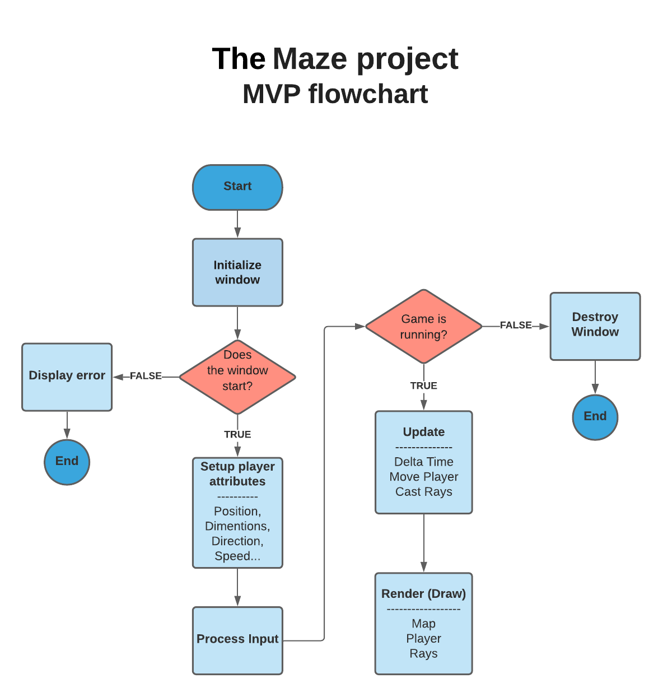

# Maze Project

## Overview

Welcome to the Maze project, an exciting 3D game development journey using raycasting. The project unfolds progressively through different tasks, each adding unique features to create an immersive gaming experience.


## About SDL2
Simple DirectMedia Layer is a cross-platform development library designed to provide low level access to audio, keyboard, mouse, joystick, and graphics hardware via OpenGL and Direct3D. It is used by video playback software, emulators, and popular games including Valve's award winning catalog and many Humble Bundle games.


## Installation

To get started with The Maze, follow these steps:

1. Clone the repository:

   ```bash
   $ git clone https://github.com/sassihamdi-CD/The-Maze.git


## Usage

To run The Maze, follow these instructions:

1. Execute the following command in the terminal:

    ```bash
    ./maze
    ```

    Alternatively, you can use the following command if you have `make` installed:

    ```bash
    make run
    ```

2. Use the following keys to navigate and interact in the game:

   - **Move forward/backward:** Up and down arrow keys (W and S also work).
   - **Turn the camera:** Right and left arrow keys (D and A also work).

Feel free to explore The Maze using these controls!

## Compilation

If you need to recompile the project, use the following command:

```bash
gcc -Wall -Werror -Wextra -pedantic ./src/*.c -lm -o maze `sdl2-config --cflags` `sdl2-config --libs`
```
### Flowchart




### General

### Tasks

### 0. Walls!

#### Overview

Create a window with SDL2 and implement raycasting to draw walls.

#### Steps

1. Set up SDL2.
2. Implement raycasting for wall rendering.
3. Provide a way to change the camera angle.

#### Example


### 1. Orientation

#### Overview

Differentiate wall colors based on their orientation (NORTH/SOUTH vs. EAST/WEST).

#### Steps

1. Enhance wall rendering to differentiate orientations.

#### Example


## 2. Rotation
You must provide a way to rotate the camera during the execution.

1.For example, you can rotate the camera when the left,right arrows are pressed on the keyboard.
2.Or you can rotate the camera when the mouse moves, just like a FPS game !

### Example


## 3. Move
You must provide a way to move the camera during the execution.

1. For example, you can move the camera when the w,a,s,d keys are pressed on the keyboard.

### Example:


### 8. Textures
1. In this part you have to add textures on your walls !

### Example


## 10. Ground textures
In this part you have to add textures on the ground and/or on the ceiling !

### Example


## 11. Weapons
Add weapons textures !

### Example


## Tips and Links

- [SDL2 - Get started.pdf](link-to-pdf)
- [SDL2 tutorials](link-to-tutorials)
- Be cautious with online tutorials; ensure SDL2, not SDL-1.2, is used.
- [Raycasting Tutorial](link-to-raycasting)
- [Alternative Raycasting Tutorial](link-to-alternative-tutorial)
- Install SDL2 and SDL2 tutorials.

## Conclusion

Enjoy the Maze project! Feel free to explore and add your creative touch to enhance the gaming experience.

